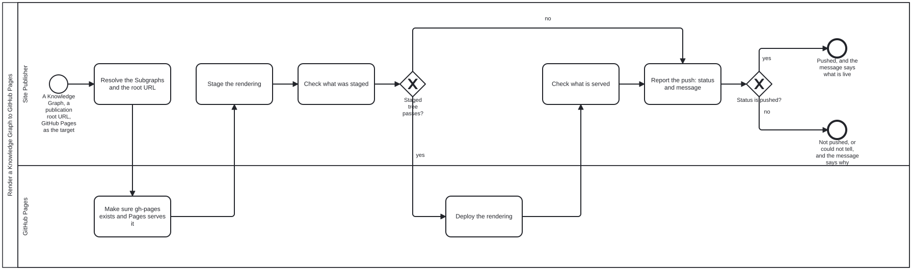

# bootstrap-tools

**The toolset that describes [`bootstrap`](https://github.com/litlfred/bootstrap), kept outside it so bootstrap does not have one.**

Bootstrap is a content Knowledge Graph: files to read (`.md`, `.json`, `.bpmn`) and nothing to run. Its README promises an agent that it needs nothing installed. So the code that writes bootstrap's schemas and checks its content lives here, beside it, and bootstrap never imports from here.

It is **one** toolset over swappable content. Someone who wants a different generator, visualiser or checker uses a different toolset against the same bootstrap.

**Contents**

<!-- kg:toc:begin -->

<!-- Generated by the bootstrap toolset (https://github.com/litlfred/bootstrap-tools, scripts/readme-sections.ts) from this README's own headings (section `kg:toc`) — do not edit; edit outside the markers, or change what it is generated from. -->
> *This section was generated by [bootstrap-tools](https://github.com/litlfred/bootstrap-tools) — [`scripts/readme-sections.ts`](https://github.com/litlfred/bootstrap-tools/blob/main/scripts/readme-sections.ts), from this README's own headings (section `kg:toc`). Do not edit it here; edit outside the markers, or change what it is generated from.*

- [What is here](#what-is-here)
- [Running it](#running-it)
- [The site](#the-site)
- [Rendering a Knowledge Graph to GitHub Pages](#rendering-a-knowledge-graph-to-github-pages)
  - [Roles](#roles)
- [Status](#status)

<!-- kg:toc:end -->

## What is here

| path | what it is |
|---|---|
| `schemas/graph.ts` | bootstrap's defined terms, in order, with what each uses and the schema that defines it; its graph typologies; the declaration shape |
| `schemas/discussion.ts`, `requirement.ts`, `model-registry.ts`, `glossary-ledger.ts` | the Zod source of the other schemas bootstrap publishes |
| `schemas/declaration.ts` | reads a Knowledge Graph declaration with bootstrap's own shape |
| `schemas/release-iri.ts` | an instance's release addresses: `<iriBase><version>/` for programs, `<iriBase>v<major>/` for people |
| `schemas/declared-order.ts` | checks that an authored order keeps its promise: each item uses only items above it |
| `scripts/gen-bootstrap-schemas.ts` | writes `bootstrap/schemas/*.schema.json` and the drawn page `bootstrap/schemas/README.md` |
| `scripts/gen-vocabulary.ts` | writes `bootstrap/ns.jsonld`, bootstrap's vocabulary: every defined term and graph typology, as RDF and SKOS, at the address its IRIs name |
| `scripts/export-graph.ts`, `schemas/graph-export.ts` | writes `<name>.jsonld`, an instance's own graph — bootstrap's, and this repository's — in bootstrap's classes and standard properties (Dublin Core, BPMN, PROV, FOAF); a Process carries its diagram's documentation, the processes it calls and its drawing. The site publishes it, nothing commits it |
| `scripts/subgraph-jsonld.ts`, `schemas/subgraph-export.ts` | an instance's named subgraphs, projected from that same graph: under `<root>subgraph/<name>/<path>/`, `index.jsonld` (each direct member a pointer, each child subgraph by IRI) and `index.hydrated.jsonld` (every node of the transitive membership inline); the instance root and the repository level (`<root>subgraph/`) have the index only, and every file names `<root>subgraph/v<major>/context.jsonld`. A Process carries its diagram's documentation (`summary`, `description`), the processes it calls, its `.bpmn` and its SVG. `site.ts` stages them for bootstrap and for this repository; `--check` validates a build |
| `scripts/publish-files.ts` | publishes bootstrap's files as they sit at its site address, never overwriting; GitHub Pages renders the `.md` |
| `scripts/rehearse-standalone.ts` | runs these tools' checks and tests with bootstrap and bootstrap-tools copied alone as sibling clones — the split, rehearsed |
| `scripts/iri-sync.ts` | keeps every literal release IRI at the declared version |
| `scripts/term-links.ts` | links each defined term in README prose to its definition |
| `scripts/subgraph-readmes.ts`, `scripts/templates/readme/` | writes each declared directory's README from its declaration, through Liquid templates; standalone it writes only the graphs these tools `support` |
| `scripts/readme-graph-sections.ts` | the `kg:processes`, `kg:files` and `kg:roles` README sections: every Process drawn, every file described from itself, every Role with all its names |
| `scripts/readme-toc.ts` | the `kg:toc` README section: a README's own level-2 and level-3 headings, linked by GitHub's anchors, outside code and outside its own region |
| `scripts/readme-sections.ts` | writes (or with `--check`, verifies) every section a README opts into by its marker pair; `--root` names the instance |
| `scripts/readme-book.ts` | every README in a repository as one page: the root's first, then each directory's by path, with a table of contents, headings demoted per section and relative links rewritten; `--check` fails on any link on the page that would not land |
| `scripts/site.ts` | stages an instance's GitHub Pages site. First every JSON Schema and JSON-LD document at the IRI it names (`$id` / `@id` under `iriBase`, an extensionless one included, with a `.json` copy beside each JSON-LD), and for bootstrap, and any instance that needs it, its graph and named subgraphs. The README page as `README.md` (served at `README.html`), ending in a "Published documents" list; then its files as they sit, also under `<version>/`; `index.html`, a redirect to `README.html` unless the instance brings its own landing page; and `_config.yml` with `_layouts/default.html`, whose footer links a generated page's generator and source rather than an edit page. `--check` stages into a temporary directory and lists every address |
| `scripts/publish-site.ts` | publishes a staged site onto a branch (default `gh-pages`) of any git remote as a full replace: clone fresh, replace every file, commit, push; a lost race retries from a fresh clone, an empty site is refused. Not tied to a CI system: an agent or a person runs `site.ts --out <dir>` then `publish-site.ts --site <dir> --remote <url>` with their own git credentials, which is all `pages.yml` and `publish-bootstrap.yml` do |
| `scripts/pages-status.ts` | the OUTPUT of rendering a Knowledge Graph to GitHub Pages: stages the site to check it, asks the publication root URL and every document address, and prints the push's status (`pushed`, `not-pushed`, `could-not-determine`) with one message naming the deployed commit and the QA result; `--json` for the whole record |
| `processes/render-kg-to-github-pages.bpmn`, `skills/render-kg-to-github-pages.md`, `scenarios/roles.json` | the toolset's own small content graph: the Process that renders a Knowledge Graph (or a list of its Subgraphs) to GitHub Pages at a publication root URL, the Skill with each step's command, and the two Roles its lanes bind |
| `scripts/init.ts` | walks an instance's initialization steps as its declarations name them. PRIMARY and first: `schemas:staged` and `schemas:published`, the JSON Schemas and JSON-LD at their IRIs. Then directories, assets, the README and its sections, needed harnesses' instructions and the Pages site. It performs what a tool can (switching Pages on needs an authenticated `gh`) and reports each as done, not done, could not determine, or stated. A 404 is not done; a 403, 407, 5xx or no answer could not be determined |
| `scripts/render-bpmn.ts` | draws each Process as an SVG beside its `.bpmn`, with bpmn-js in headless Chromium; the harness's site renderer uses the same drawing |
| `scripts/git-files.ts` | the files git accounts for — tracked, plus untracked and not ignored |
| `scripts/check-closure.ts` | fails if anything here imports beyond itself, `zod`, `liquidjs`, `@playwright/test` and the runtime |
| `scripts/check-node-iris.ts` | fails if a published node's identifier is not its file's path |
| `scripts/check-bootstrap-concepts.ts` | checks bootstrap's requirement concepts |

## Running it

Every tool is a script an agent runs, as the actor in a process step, or a person runs by hand. None needs a service.

```sh
bun run --cwd bootstrap-tools schemas          # regenerate bootstrap's schemas and schema page
bun run --cwd bootstrap-tools readmes          # regenerate bootstrap's directory READMEs
bun run --cwd bootstrap-tools render           # redraw each Process beside its .bpmn
bun run --cwd bootstrap-tools vocabulary       # regenerate bootstrap/ns.jsonld
bun run --cwd bootstrap-tools graph -- --root ../bootstrap --base-url <site>/bootstrap/ --out bootstrap.jsonld
bun run --cwd bootstrap-tools subgraphs -- --root ../bootstrap --out ../_site-src   # named subgraphs, under subgraph/
bun run --cwd bootstrap-tools subgraphs:check  # both instances' subgraphs validate, and every diagram is a documented Process
bun run --cwd bootstrap-tools schemas:check    # fail if they are stale
bun run --cwd bootstrap-tools check:closure    # nothing here imports above bootstrap
bun run --cwd bootstrap-tools check:node-iris  # every published identifier is its file's path
bun run --cwd bootstrap-tools test
bun run --cwd bootstrap-tools readme-sections -- --root ../bootstrap   # README sections, the TOC among them
bun run --cwd bootstrap-tools book -- --root ../bootstrap --check      # the one-page README: every link lands
bun run --cwd bootstrap-tools site -- --root ../bootstrap --out ../_site-src
bun run --cwd bootstrap-tools init -- --root ../bootstrap              # every initialization step, checked; --dry-run to only check
```

## The site

The site is how a harness's JSON Schemas and JSON-LD reach the IRIs they
name, which is the primary initialization step; the README page rides along.
bootstrap-tools itself declares no `iriBase` and publishes no JSON Schema of
its own (its schemas are the Zod that bootstrap's are generated from), so its
site carries its README page and files, and its own graph,
`bootstrap-tools.jsonld`, with its named subgraphs under `subgraph/` — at its
GitHub Pages address, since it declares no other. That graph is written in
bootstrap's classes, so `pages.yml` checks bootstrap out beside the tools.

Every site's named subgraphs start at one file, `<root>subgraph/index.jsonld`:
<https://litlfred.github.io/bootstrap/subgraph/index.jsonld> and
<https://litlfred.github.io/bootstrap-tools/subgraph/index.jsonld>. Each lists
its instance's root, whose index lists its top-level subgraphs; a `processes`
subgraph's `index.hydrated.jsonld` holds every Process node inline.

Both sites are published from this repository. `.github/workflows/pages.yml`
publishes this one's on each push to `main`;
`.github/workflows/publish-bootstrap.yml` publishes bootstrap's on a schedule
and by hand, because bootstrap carries no workflow that names these tools
(owner, 2026-10-01) and a push there cannot trigger one here. Each checks out
the instance and these tools side by side, runs `site.ts`, and commits the
staged directory onto that instance's `gh-pages` branch as a full replace —
bootstrap's with the `PUBLISH_SITE_BOOTSTRAP` token (the harness GitHub App, or a secret of that name), since this
repository's own token cannot push to another. GitHub Pages builds that
branch with Jekyll. The `gh-pages` branch has to exist before Pages can be
switched on to serve it (`init.ts` step `site:branch`); then Pages has to be on, serving `gh-pages` at `/`:
`init.ts` switches it on when an authenticated `gh` is present, and
otherwise prints the one step for a person, at
`https://github.com/<owner>/<repo>/settings/pages`. It never reports an
unchecked step as done.

In this repository the same commands are also root scripts (`bootstrap:schemas`, `check:tools-closure`, `check:node-iris`, `iri:sync`) and run in the gate set.

## Rendering a Knowledge Graph to GitHub Pages

The same steps whether the root URL is a staging preview or a release:
resolve the Subgraphs and the root URL, stage (`site.ts [--subgraph <id>]…`),
check the staging, deploy (the Pages workflow), check what is served, and
report (`pages-status.ts`). The output is the push's status and one message:
the commit that is live and the QA result. Each step and its command are in
[`skills/render-kg-to-github-pages.md`](skills/render-kg-to-github-pages.md).

<!-- kg:processes:begin -->

<!-- Generated by the bootstrap toolset (https://github.com/litlfred/bootstrap-tools, scripts/readme-sections.ts) from the Process diagrams the declaration lists (section `kg:processes`) — do not edit; edit outside the markers, or change what it is generated from. -->
> *This section was generated by [bootstrap-tools](https://github.com/litlfred/bootstrap-tools) — [`scripts/readme-sections.ts`](https://github.com/litlfred/bootstrap-tools/blob/main/scripts/readme-sections.ts), from the Process diagrams the declaration lists (section `kg:processes`). Do not edit it here; edit outside the markers, or change what it is generated from.*

**Render a Knowledge Graph to GitHub Pages**: [`processes/render-kg-to-github-pages.bpmn`](processes/render-kg-to-github-pages.bpmn), the one you start.



<!-- kg:processes:end -->

### Roles

<!-- kg:roles:begin -->

<!-- Generated by the bootstrap toolset (https://github.com/litlfred/bootstrap-tools, scripts/readme-sections.ts) from the Roles the instance declares (section `kg:roles`) — do not edit; edit outside the markers, or change what it is generated from. -->
> *This section was generated by [bootstrap-tools](https://github.com/litlfred/bootstrap-tools) — [`scripts/readme-sections.ts`](https://github.com/litlfred/bootstrap-tools/blob/main/scripts/readme-sections.ts), from the Roles the instance declares (section `kg:roles`). Do not edit it here; edit outside the markers, or change what it is generated from.*

| Role | what it is | also called | formerly |
|---|---|---|---|
| **Site Publisher** | Renders a [Knowledge Graph](https://litlfred.github.io/bootstrap/schemas/#knowledge-graph) — the whole of it, or a list of its [Subgraphs](https://litlfred.github.io/bootstrap/schemas/#subgraph) — for GitHub Pages at a publication root URL, has it deployed, checks what is served,… |  |  |
| **GitHub Pages** | The host that serves what the Site Publisher deployed, at the publication root URL. |  |  |

<!-- kg:roles:end -->

## Status

Staged here as a sibling directory until `litlfred/bootstrap-tools` gets its first commit. The package is `private` until its first release; removing that is part of the release step. Bean `xsqm`.
